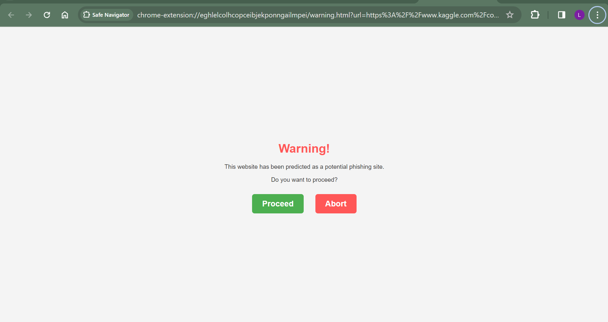

# Phishing URL Detection Chrome Extension

  

> A Chrome extension built for predicting potential phishing URLs using a Gradient Boost Classifier with a 96% accuracy.

---

## Table of Contents

- [Description](#description)
- [Features](#features)
- [Tech Stack](#tech-stack)
- [Installation](#installation)
- [Usage](#usage)
- [Result Screenshots](#result-screenshots)

---

## Description

The Phishing URL Detection Chrome Extension is designed to enhance online security by predicting potential phishing URLs in real-time. The extension leverages a Gradient Boost Classifier model, achieving an impressive accuracy of 96%. With a seamless integration into the Chrome browser, users are alerted to potential threats, fostering a safer browsing experience.

---

## Features

- **Real-time Phishing Detection**: Predicts potential phishing URLs as users navigate the web.
- **Gradient Boost Classifier**: Utilizes a machine learning model with a high accuracy of 96%.
- **Seamless Chrome Integration**: Enhances security without compromising user experience.

---

## Tech Stack

- **Frontend**: JavaScript, HTML, CSS
- **Backend**: Flask (Python)
- **Machine Learning Model**: Gradient Boost Classifier
- **Chrome API**: Web Navigation API

---

## Installation

1. Clone the repository.
2. Load the extension in Chrome by navigating to `chrome://extensions/`.
3. Enable "Developer mode" and click "Load unpacked."
4. Select the extension folder.

---

## Usage

1. Navigate to a webpage.
2. The extension will provide real-time alerts if the URL is predicted to be a potential phishing site.
3. Stay informed and browse securely with the Phishing URL Detection Chrome Extension.

### Result Screenshots

